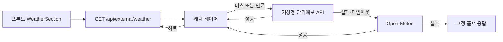

# 날씨: 기상청(한국) + 짧은 캐시 + Open-Meteo 폴백 설계

> 대시보드 `/api/external/weather`를 **한국 공식 단기예보 우선**, **캐시로 부하·장애 완화**, **실패 시 Open-Meteo**로 보완하는 구조.

---

## 1. 목표

| 목표 | 설명 |
|------|------|
| 데이터 정합 | 사용자 체감상 **기상청 단기예보**와 맞는 날씨·기온 |
| 가용성 | 기상청 API 지연·오류 시 **Open-Meteo**로 즉시 대체 |
| 비용·한도 | 공공데이터 **일일 호출 한도**(예: 10,000건/일) 절약 → **짧은 TTL 캐시** |
| 응답 시간 | 반복 요청은 **캐시 히트**로 수 ms ~ 수십 ms 수준 |

---

## 2. 전체 아키텍처



**역할 요약**

1. 요청 들어옴 → **캐시 키**로 조회 (히트면 외부 호출 없음).
2. **미스/만료** → **1차 기상청** 호출 (짧은 타임아웃).
3. 실패(HTTP 오류, 파싱 실패, 타임아웃, 필수 필드 없음) → **2차 Open-Meteo** (기존 로직 재사용).
4. 둘 다 실패 → 현재와 동일한 **고정 폴백** 또는 마지막 성공 스냅샷(선택).

---

## 3. 1차 소스: 기상청(공공데이터)

### 3.1 추천 API

| API | 용도 | 비고 |
|-----|------|------|
| **단기예보** `VilageFcstInfoService_2.0` / `getVilageFcst` | 동네 격자 단기예보 (TMP, SKY, PTY 등) | [공공데이터포털](https://www.data.go.kr) 활용신청, **ServiceKey** 필요 |
| (선택) **초단기실황** `VilageFcstInfoService_2.0` / `getUltraSrtNcst` | “지금”에 가까운 실황 | 발표시각·격자는 단기와 동일 패턴 |

**대시보드 카드**에 “현재 기온 + 하늘상태(또는 강수)” 정도면, 우선 **단기예보**에서 **가장 가까운 예보 시각**의 `TMP`, `SKY`, `PTY`만 조합해도 충분합니다. “실시간” 강조가 필요하면 초단기실황을 1차로 두고 단기를 보조할 수 있습니다.

### 3.2 필수 파라미터 개념

- `serviceKey`: URL 인코딩(이중 인코딩 주의).
- `nx`, `ny`: **기상청 격자 좌표**. 위도·경도는 **변환 함수**로 `nx, ny` 계산 (행정안전부/LGT 공식과 동일한 변환식 사용).
- `base_date`, `base_time`: **발표 시각**. 단기예보는 보통 **02, 05, 08, 11, 14, 17, 20, 23시** 중 최신에 가까운 회차를 선택하는 **소규모 로직**이 필요합니다(현재 시각 기준으로 “아직 안 나온 회차”는 이전 회차 사용).

### 3.3 응답 → 내부 모델

공통 응답 모델은 기존 `WeatherResponse` 유지 권장:

- `temperature`: `TMP` (또는 초단기 `T1H`)
- `description` / `icon`: `SKY`(맑음/구름/흐림), `PTY`(강수형태) 조합 → 한 줄 문구 + 이모지 매핑 테이블

---

## 4. 2차 소스: Open-Meteo (폴백)

- 기존 `external.py`의 `current_weather` 호출을 **함수로 분리**해 재사용.
- **폴백 조건**: 기상청 호출 예외, 4xx/5xx, 빈 items, 파싱 실패, 타임아웃.
- 좌표는 **동일**하게 `lat`, `lon` 사용(프론트에서 쿼리로 넘기거나 서울 기본값).

---

## 5. 캐시 레이어

### 5.1 캐시 키

```
weather:v1:{round_lat}:{round_lon}:{nx}:{ny}
```

- 위치 정밀도: `lat/lon`을 소수점 2~3자리 반올림하거나, **격자만** 쓰면 `weather:v1:{nx}:{ny}`로 단순화.
- 사용자별이 아니라 **좌표(또는 격자) 단위**로만 캐시하면 됨.

### 5.2 TTL

| 환경 | 권장 TTL | 이유 |
|------|----------|------|
| 프로덕션 | **10~15분** | 단기예보 갱신 주기·한도 절약·체감 “최신” 균형 |
| 개발 | 1~2분 또는 끄기 | 디버깅 편의 |

만료 직후 첫 요청만 외부 API를 타므로, 트래픽 대비 **일일 호출 추정 = (활성 격자 수) × (86400 / TTL초)** 로 상한을 직관적으로 검토할 수 있습니다.

### 5.3 구현 옵션

| 방식 | 장점 | 단점 |
|------|------|------|
| **프로세스 메모리** (`dict` + TTL) | 의존성 없음, 단일 uvicorn 워커면 충분 | 멀티 워커/다중 인스턴스마다 캐시 분리 |
| **Redis** | 인스턴스 간 공유, TTL 내장 | 인프라 추가 |

초기에는 **단일 백엔드 인스턴스 + 메모리 캐시**로 시작하고, 스케일 아웃 시 Redis로 이전하는 전략이 무난합니다.

### 5.4 스탬프 필드 (권장)

캐시 값에 함께 저장:

- `source`: `"kma"` | `"open_meteo"` | `"fallback"`
- `fetched_at`: ISO 시간

프론트에서 “N분 전 갱신” 표시나 디버깅에 유용합니다(선택).

---

## 6. 타임아웃·에러 정책

| 단계 | 타임아웃 제안 | 비고 |
|------|----------------|------|
| 기상청 | **2.5 ~ 3.0초** | 공공 API는 가끔 느림 |
| Open-Meteo | **3.0 ~ 5.0초** | 폴백이므로 약간 여유 |
| 전체 핸들러 | **총 ~6초 이내** 목표 | 그 전에 응답 권장 |

기상청만 실패했을 때는 **반드시** Open-Meteo로 넘어가므로, 사용자에게는 “항상 뭔가” 나오게 됩니다.

---

## 7. 설정 (`backend/.env`)

```env
# 공공데이터포털 인증키 (디코딩된 키를 넣고 코드에서 encode)
KMA_SERVICE_KEY=

# 선택: 기본 격자(서울 시청 등) — lat/lon 미전달 시
WEATHER_DEFAULT_NX=60
WEATHER_DEFAULT_NY=127

# 캐시 TTL(초)
WEATHER_CACHE_TTL_SECONDS=600

# true면 기상청 건너뛰고 Open-Meteo만 (로컬/장애 대응)
WEATHER_FORCE_OPEN_METEO_ONLY=false
```

---

## 8. API 스펙 (외부 노출 유지)

- `GET /api/external/weather?lat=&lon=`  
  - **쿼리는 그대로** 두고, 내부에서만 격자 변환 → 캐시 → KMA → OPM 순으로 처리.
- 응답 스키마: 기존 `WeatherResponse` 유지 (프론트 수정 최소화).

---

## 9. 구현 순서 (권장)

1. Open-Meteo 로직을 `fetch_open_meteo_weather(lat, lon)` 함수로 분리.
2. 격자 변환 `lat_lon_to_kma_grid(lat, lon)` 및 `base_date/base_time` 선택 유틸 추가.
3. `fetch_kma_vilage_fcst(nx, ny, ...)` 구현 및 TMP/SKY/PTY → `WeatherResponse` 매핑.
4. 메모리 캐시 래퍼 `get_weather_cached(lat, lon)`에서 위 순서 조합.
5. `route handler`는 캐시 함수만 호출.
6. (선택) 프론트에 로딩 스켈레톤 및 `source` 디버그 표시.

---

## 10. 운영 시 유의사항

- **ServiceKey**: 브라우저에 노출 금지(항상 백엔드만 호출).
- **호출 한도**: 공공데이터 **일일 한도** 초과 시 에러 본문 확인; 캐시 TTL로 완화.
- **HTTPS**: `apis.data.go.kr`는 HTTPS 사용 권장.

이 문서만으로 백엔드 리팩터 방향이 정해지면, 다음 커밋에서 `external.py` 모듈 분리 + 캐시 + KMA 클라이언트 순으로 구체 구현하면 됩니다.
